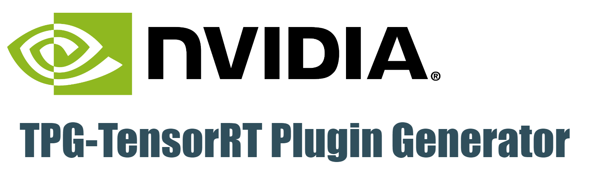
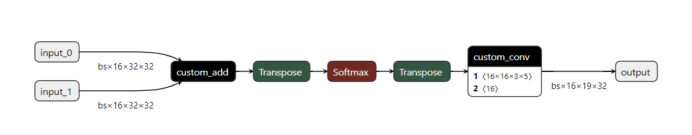
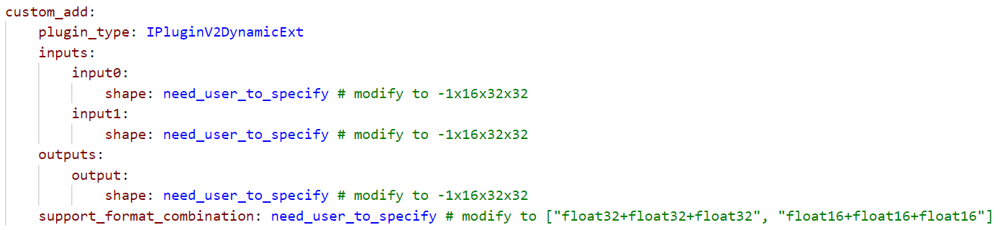

# TPG: TensorRT Plugin Generator


- [TPG: TensorRT Plugin Generator](#tpg-tensorrt-plugin-generator)
  - [1. Installation](#1-installation)
  - [2. Usage](#2-usage)
    - [2.1 Generate plugin yaml for Unsupported Operators](#21-generate-plugin-yaml-for-unsupported-operators)
    - [2.2 Complete the yaml config](#22-complete-the-yaml-config)
    - [2.3 Generate Plugin Codes From the plugin yaml](#23-generate-plugin-codes-from-the-plugin-yaml)
    - [2.4 Finish The Plugin Inference Kennel](#24-finish-the-plugin-inference-kennel)
  - [3. Best Practice](#3-best-practice)

TPG is a tool that can quickly generate the plugin code(**NOT INCLUDE THE INFERENCE KERNEL IMPLEMENTATION**) for TensorRT unsupported operators. the user only need to focus on the plugin kernel implementation and doesn't need to worry about how does TensorRT plugin works or how to use the plugin API.
## 1. Installation

```
git clone https://github.com/NVIDIA-AI-IOT/tensorrt_plugin_generator
cd trt-plugin-generator
pip3 install pyyaml
```

## 2. Usage

### 2.1 Generate plugin yaml for Unsupported Operators


```
python tpg.py extract --onnx model.onnx --custom_operators custom_add,custom_conv --yaml plugin.yml
```


### 2.2 Complete the yaml config

User still need to edit the generated YAML file to specify some information explicitly since TPG can not deduce them from onnx directly or it depends on how the plugin works while TPG know nothing about it. All the items need user to specify has marked as "need_user_to_specify".

Items to check:
1. Inputs/Outputs Shapes(if TPG can not get it from onnx directly, see image below)
2. Support format combination(must specify, it depends on how you implement the plugin, whether you want to support FP16/INT8 for your plugin, see image below)

For example, to complete the `custom_add` in the above diagram, we can modify the yaml config as below:


For more information, you can refer to [how to edit the yaml](./doc/edit_yaml_config.md). also TPG will throw assertion error if you make mistakes in the config yaml.

### 2.3 Generate Plugin Codes From the plugin yaml

Once we have a valid yaml file, we can generate the plugin code all in once now:

```
python tpg.py generate --yaml plugin.yml --output ./plugin_codes
```

For more options(e.g. to specify the trt library path):
```
python tpg.py generate -h
```

We can see the generated plugin codes under ./plugin_codes. with a Makefile that can be used for compile a minimal dynamic library.

The compiled library can be loaded with `trtexec --plugins=libMyFancyPlugin.so` or be loaded with dlopen(refer to [link](https://github.com/NVIDIA/TensorRT/blob/b55c4710ce01f076c26710a48879fcb2661be4a9/samples/common/common.h#L893)).

### 2.4 Finish The Plugin Inference Kennel

Now it's your turn to finish the remaining works to make the plugin work as you expect. You need to take care of the following function:
- getOutputDimensions() -> if the plugin has dynamic shape outputs, because TPG don't know how to deduce the outputs dimension from inputs, the user need to implement this function otherwise TPG will throw a assertion fail.
- enqueue() -> Must have, The most important part, this is where you implement how does your plugin work during inference.
- initialize() -> Optional, allocate extra resource for enqueue(), e.g. allocate some device buffer for intermediate results.
- terminate() -> Optional, all resource allocate in initialize() will need to be free here.
- configurePlugin() -> Optional, you can have multiple enqueue implementation for better performance with different inputs desc.
- getWorkspaceSize() -> Optional, return the size what initialize() needs to allocate.

We have detailed comments in the generated plugin code to help you finish those parts, don't be afraid, you can do it :-)

## 3. Best Practice

For the detailed usage of TPG, you can refer to our [samples](./samples/readme.md)

More tips:
- Enable DEBUG_PLUGIN micro at the start of the generated cpp file so that you can catch call log of the plugin API, it's enable by default.
- provide more information in the yaml as much as possible so that TPG can take the work for you, e.g. if you know your plugin's output is -1x1x1, then specify it -1x1x1 is better than -1x-1x-1, the latter will require you to handle extra unknown dimensions.

